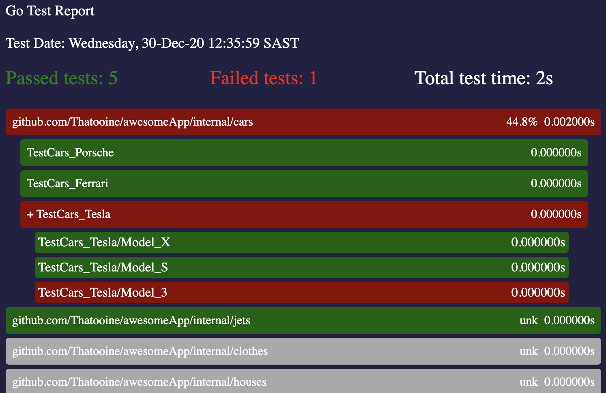

# go-test-html-report
`go-test-html-report` generates a prettified html report of go-test logs.
## Installation 
```shell 
$ go get -u github.com/Thatooine/go-test-html-report
```
## Usage
To use `go-test-html-report` with a go test log file use
 ```shell 
 $ go-test-html-report -f ./test.log
 ```
where `./test.log` generated by calling
 ```shell 
 $ go test -v -cover -json  ./...  |tee test.log 
 ```
Another way to use `go-test-html-report` is by reading the logs from stdout. Use the following command. 
 ```shell 
 $  go test -v -cover -json  ./... | go-test-html-report
 ```

## Interpreting html report
<p align="center">
  
</p>

The html report groups tests by packages and the test cases by tests. Cards are collapsible if a package contains tests, or a test contains test cases. To view code coverage details on the cards pass the coverage flag in the go test command.
## Contribute & Support

- Add a GitHub Star
- Suggest [new features, ideas and optimizations](https://github.com/Thatooine/go-test-html-report/issues)
- [Report issues](https://github.com/Thatooine/go-test-html-report/issues)